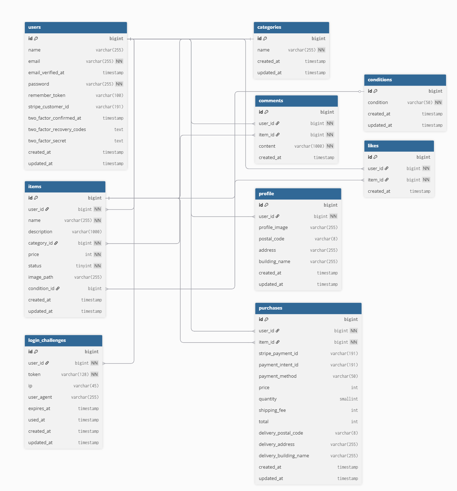

## 環境構築

### Dockerビルド
- `git clone https://github.com/kousukekunitomo/flea-market-app`
- `cd flea-market-app`
- `docker compose up -d --build`


### Laravel環境構築
- `docker compose exec app bash`
- `composer install`
- `cp .env.example .env`
- `php artisan key:generate`
- `php artisan migrate`
- `php artisan db:seed`
- `php artisan storage:link`


### Laravel環境構築
- `新規登録: http://localhost:8000/register`
- `ログイン: http://localhost:8000/login`
- `MailHog: http://localhost:8025`
- `phpMyAdmin: http://localhost:8080`


### Stripe (dev)
1) `stripe listen --forward-to http://localhost:8000/api/stripe/webhook`
2) 出力された Signing secret を `.env` の `STRIPE_WEBHOOK_SECRET` に設定
3) `php artisan config:clear`


## Demo Login
- Email: `admin@example.com`
- Password: `mmmmmmmm`

## ER Diagram
<p align="center">
  
</p>

## Running Feature Tests (SQLite)

The test suite for `--env=testing` uses **SQLite**, so MySQL is not required.

### 1) One-time setup
```bash
mkdir -p database
[ -f database/testing.sqlite ] || : > database/testing.sqlite

cat > .env.testing <<'EOF'
APP_ENV=testing
APP_KEY=base64:AAAAAAAAAAAAAAAAAAAAAAAAAAAAAAAAAAAAAAAAAAA=
APP_DEBUG=true
DB_CONNECTION=sqlite
DB_DATABASE=database/testing.sqlite
EOF
